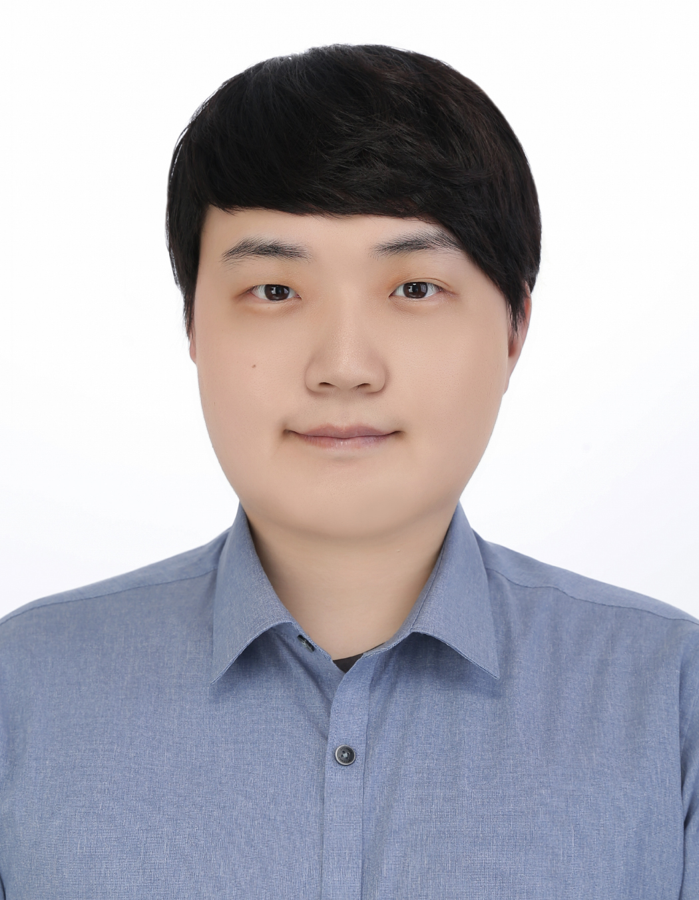

#tube-clone-project
유튜브 클론 프로젝트

## 1. 개요
- 장고 프레임워크에서 유튜브 기능을 구현하여 장고를 학습

## 2. 프로필
<table>
    <tr>
        <th>신찬수</th>
    </tr>
        <td></td>
</table>

## 3. 개발환경
- 운영체제
    - Windows 10
- 에디터
    - VS Code
- 프레임워크
    - Django

## 4. Django 및 라이브러리 버전
```
asgiref==3.7.2
Django==5.0.2
pillow==10.2.0
sqlparse==0.4.4
tzdata==2024.1
```

## 5. 프로젝트 구조
|          기능           |                                URL                                 
| :---------------------: | :----------------------------------------------------------------: |
|     메인페이지     |                              /tube                                
|      회원가입      |                              /accounts/signup                          
|       로그인       |                              /accounts/login/                          
|      로그아웃      |                              /accounts/logout                          
|     프로필 조회    |                              /accounts/profile
|     게시물 조회    |                              /tube/int:pk
|       글 쓰기      |                              /tube/create
|   게시물 업데이트  |                              /tube/int:pk/update
|     컨텐츠 삭제    |                              /tube/int:pk/delete
|     태그 별 조회   |                              /tube/tag/str:tag
|      댓글 삭제     |                              /tube/int:pk/comment_delete
|        구독        |                              /tube/int:post_id/int:user_id/subscribe
|      구독 취소     |                              /tube/int:post_id/int:user_id/unsubscribe
                                        
## 6. ER diagram


## 7. 시연
| 회원가입 |
| |
| 로그인 |
| |
| 프로필 확인 |
| |
| 게시물 생성 및 삭제 |
|  |
| 댓글 생성 및 삭제 |
|  |
| 구독 및 구독 취소 |
|  |

## 8. 사용방법
0. (옵션) 기존 내용을 지우고 사용하고자 한다면
```
- db.sqlite3 파일 삭제
- .\media\blog\files 하위 폴더 삭제
- .\media\images 하위 폴더 삭제
```
1. 가상환경 생성 및 활성화
```cmd
> python -m venv venv
> .\venv\Scripts\activate # 리눅스 환경이라면, source venv/bin/activate
```
2. 필수 라이브러리 설치
```cmd
> pip install -r requirements.txt
```
3. DB 마이그레이션
```cmd
> python manage.py migrate
```
4. admin 계정 새로 생성 (기존 admin 계정: admin, 비밀번호: Admin12#$)
```cmd
> python manage.py createsuperuser
```
5. 장고 서버 실행
```cmd
> python manage.py runserver
```
6. 접속
```cmd
http://127.0.0.1:8000/tube/
```

# 9. 기타 개발 수정 옵션
- 화이트리스트 : ./config/settings.py => ALLOWED_HOSTS 옵션에서 특정 IP 또는 특정 IP 대역을 지정할 수 있다.
- 서드파티 DB 연동 : ./config/settings.py => DATABASES 옵션에서 MySQL, PostgresSQL 등의 DB를 연동할 수 있다. (기본 DB: sqlite3)
- 배포 전환 시 오류 페이지 : ./config/settings.py => DEBUG = False => 페이지가 없거나 에러 발생시 디버그 화면이 나오지 않게 되며, 대신 대체 페이지를 설정하면 된다.
- 배포 목적이면, 안정성과 성능의 이유로 Nginx와 gunicorn을 사용하는 것을 권장한다.
